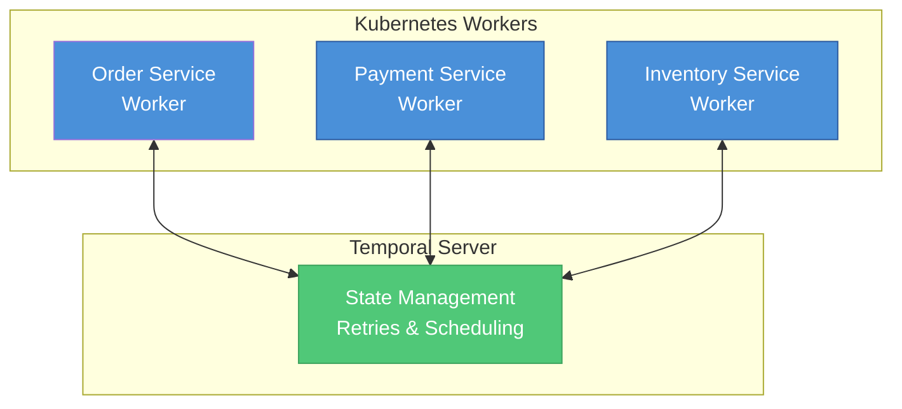
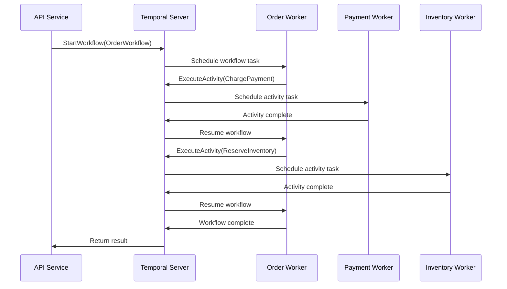
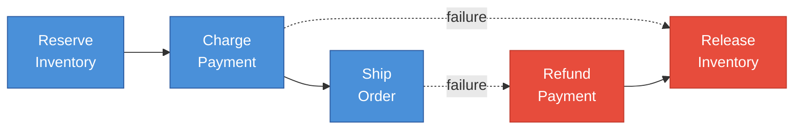

# Temporal with Kubernetes Microservices for Go

Temporal is a workflow orchestration platform that pairs exceptionally well with Kubernetes microservices. This guide covers how they work together in Go applications, providing patterns and best practices for building resilient distributed systems.

---

## Core Architecture

Temporal separates your application into two main components:

**1. Temporal Workers** — Long-running processes that execute your workflow and activity code. In Kubernetes, these run as Deployments that poll the Temporal server for tasks.

**2. Temporal Server** — The orchestration backend (often deployed via Helm chart) that handles state, scheduling, and retry logic.

---

## Basic Go Setup

Here's a basic worker setup in Go that connects to the Temporal server:

```go
// worker/main.go
package main

import (
    "go.temporal.io/sdk/client"
    "go.temporal.io/sdk/worker"
)

func main() {
    c, _ := client.Dial(client.Options{
        HostPort: "temporal-frontend:7233", // Kubernetes service name
    })
    defer c.Close()

    w := worker.New(c, "my-task-queue", worker.Options{})
    
    // Register workflows and activities
    w.RegisterWorkflow(OrderWorkflow)
    w.RegisterActivity(ChargePayment)
    w.RegisterActivity(ShipOrder)
    
    w.Run(worker.InterruptCh())
}
```

---

## How It Fits With Microservices

In a Kubernetes environment, Temporal acts as the "glue" between services:



### Pattern 1: Activity-per-Service

Each microservice registers its own activities. A workflow can call activities across multiple services:

```go
func OrderWorkflow(ctx workflow.Context, order Order) error {
    // Calls activity in payment-service worker
    workflow.ExecuteActivity(ctx, ChargePayment, order.PaymentInfo).Get(ctx, nil)
    
    // Calls activity in inventory-service worker
    workflow.ExecuteActivity(ctx, ReserveInventory, order.Items).Get(ctx, nil)
    
    // Calls activity in shipping-service worker
    workflow.ExecuteActivity(ctx, ShipOrder, order.ShippingInfo).Get(ctx, nil)
    
    return nil
}
```

### Pattern 2: HTTP/gRPC Calls in Activities

Activities can call other microservices directly via HTTP or gRPC:

```go
func ChargePayment(ctx context.Context, info PaymentInfo) error {
    // Call another microservice via HTTP/gRPC
    resp, err := paymentClient.Charge(ctx, &pb.ChargeRequest{
        Amount:   info.Amount,
        Currency: info.Currency,
        Token:    info.Token,
    })
    return err
}
```

---

## Workflow Execution Flow



---

## Kubernetes Deployment

A typical Kubernetes deployment for a Temporal worker:

```yaml
apiVersion: apps/v1
kind: Deployment
metadata:
  name: order-worker
spec:
  replicas: 3  # Scale workers horizontally
  selector:
    matchLabels:
      app: order-worker
  template:
    metadata:
      labels:
        app: order-worker
    spec:
      containers:
      - name: worker
        image: myapp/order-worker:latest
        env:
        - name: TEMPORAL_HOST
          value: "temporal-frontend.temporal:7233"
        resources:
          requests:
            memory: "128Mi"
            cpu: "100m"
          limits:
            memory: "256Mi"
            cpu: "500m"
```

---

## Key Benefits in Kubernetes

- **Automatic Retries** — Temporal handles failures without custom retry logic
- **Durable State** — Workflow state survives pod restarts and node failures
- **Horizontal Scaling** — Just increase worker replicas; Temporal distributes work automatically
- **Saga Pattern Built-in** — Compensating transactions are easy to implement
- **Visibility** — Temporal Web UI shows workflow status across all services
- **Versioning** — Deploy new workflow versions without breaking running workflows

---

## Triggering Workflows

Your API service (or any service) can start workflows programmatically:

```go
func (h *Handler) CreateOrder(w http.ResponseWriter, r *http.Request) {
    workflowOptions := client.StartWorkflowOptions{
        ID:        "order-" + uuid.New().String(),
        TaskQueue: "order-task-queue",
    }
    
    we, err := h.temporalClient.ExecuteWorkflow(
        ctx, 
        workflowOptions, 
        OrderWorkflow, 
        order,
    )
    if err != nil {
        http.Error(w, err.Error(), http.StatusInternalServerError)
        return
    }
    
    // Returns immediately; workflow runs asynchronously
    json.NewEncoder(w).Encode(map[string]string{
        "workflow_id": we.GetID(),
        "run_id":      we.GetRunID(),
    })
}
```

---

## Best Practices

- **Keep workflows deterministic** — Don't use random numbers, current time, or external calls directly in workflows
- **Use activity timeouts** — Always set `StartToClose` and `ScheduleToClose` timeouts for activities
- **Implement idempotency** — Activities should be idempotent since they may be retried
- **Use task queues strategically** — Separate task queues for different service types or priorities
- **Monitor with metrics** — Export Temporal SDK metrics to Prometheus for observability
- **Version your workflows** — Use workflow versioning when making breaking changes

---

## Error Handling: Saga Pattern

Temporal provides built-in support for the Saga pattern with compensations:



```go
func OrderWorkflow(ctx workflow.Context, order Order) error {
    var compensations []func(context.Context) error
    
    // Step 1: Reserve inventory
    err := workflow.ExecuteActivity(ctx, ReserveInventory, order).Get(ctx, nil)
    if err != nil {
        return err
    }
    compensations = append(compensations, func(ctx context.Context) error {
        return ReleaseInventory(ctx, order)
    })
    
    // Step 2: Charge payment
    err = workflow.ExecuteActivity(ctx, ChargePayment, order).Get(ctx, nil)
    if err != nil {
        // Compensate: release inventory
        for i := len(compensations) - 1; i >= 0; i-- {
            workflow.ExecuteActivity(ctx, compensations[i], order)
        }
        return err
    }
    
    return nil
}
```

---

## Activity Options

Configure retry behavior and timeouts for activities:

```go
func OrderWorkflow(ctx workflow.Context, order Order) error {
    activityOptions := workflow.ActivityOptions{
        StartToCloseTimeout: 10 * time.Second,
        RetryPolicy: &temporal.RetryPolicy{
            InitialInterval:    time.Second,
            BackoffCoefficient: 2.0,
            MaximumInterval:    time.Minute,
            MaximumAttempts:    5,
        },
    }
    ctx = workflow.WithActivityOptions(ctx, activityOptions)
    
    return workflow.ExecuteActivity(ctx, ChargePayment, order).Get(ctx, nil)
}
```

---

## Resources

- [Temporal Documentation](https://docs.temporal.io)
- [Temporal Go SDK](https://github.com/temporalio/sdk-go)
- [Temporal Helm Charts](https://github.com/temporalio/helm-charts)
